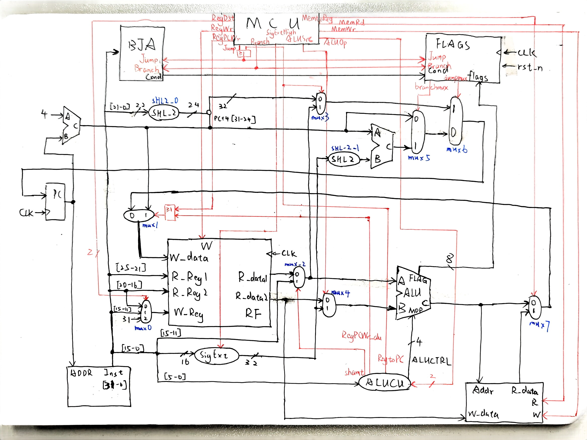
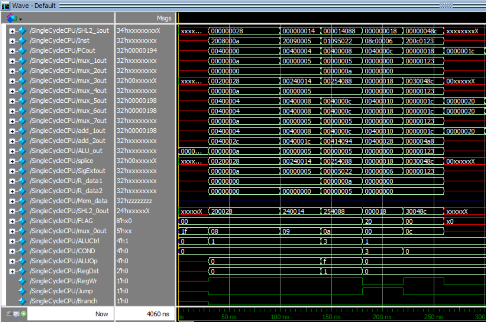

# CPU-Verilog-SingleCycle
XJTU  COMP461805 CPU（Verilog）单周期实现

本仓库为西安交通大学2025秋季学期**计算机试验班**，**计算机组成原理**课程大作业，基于Verilog的指令集CPU实现，包括**单周期、多周期以及流水线**三种结构，对应到本仓库的3个分支：main、multi_cycle、pipeline。

本分支为**单周期CPU**的实现。

本仓库的完成人为：
- 计试2301，[李奕博](https://github.com/YiboLi-4110)
- 计试2301，[刘添毅](https://github.com/Leotydk671)

# 单周期CPU简介
单周期 CPU 是指每条指令在**一个时钟周期**内完成取指、译码、执行、访存、写回五个阶段。其核心思想是将所有操作组合在一个周期内完成，因此控制逻辑简单，但时钟周期受最长指令路径限制。

本文中实现的单周期 cpu 支持 MIPS 指令集中的大部分指令，并**做了一定的扩展**。数据通路中，包含寄存器堆、ALU、指令与数据存储器、控制器等核心模块。同时，也为实现扩展的指令而**增加了自定义模块**，详细信息请参考“补充说明”一节。

# 指令集：80-MIPS-86
本仓库共实现了<font color='red'>89</font>条指令，与标准的X86-64和MIPS指令集均相似但不相同，具体如下：
| 功能分类 | 助记符与功能 |
|:-----:|:-----:|
| 加载 | LW(加载字) |
| 保存 | SW(存储字) |
| R-R运算 | ADD(加) ADDU(无符号加) SUB(减) SUBU(无符号减) SLL(逻辑左移) SRL(逻辑右移) SRA(算术右移) AND(与) OR(或) XOR(异或) NOR(或非) SLT(有符号小于置1) SLTU(无符号小于置1) |
| R-I运算 | ADDI(加立即数) ADDIU(无符号加立即数) ANDI(与立即数) ORI(或立即数) XORI(异或立即数) LUI(加载立即数至高位) SLTI(小于立即数置1) SLTIU(无符号小于立即数-无符号数) |
| 分支 | BEQ(等于0则分支) BNE(不等于0则分支) BLEZ(小于等于0则分支) BGTZ(大于0则分支) BLTZ(小于0则分支) BGEZ(大于等于0则分支) |
| 跳转 | J(跳转) JAL(跳转并链接) JALR(跳转并链接寄存器) JR(跳转至寄存器) |
| 有条件跳转一 | JE(等于0则跳转) JNE(不等于0则跳转) JA(无符号大于0跳转) JNA(无符号不大于0跳转) JB(无符号小于0则跳转) JNB(无符号不小于0则跳转) JG(有符号大于0则跳转) JNG(有符号小于等于0则跳转) JL(有符号小于0则跳转) JNL(有符号不小于0则跳转) JS(符号位为1则跳转) JNS(符号位为0则跳转) JO(溢出则跳转) JNO(不溢出则跳转) |
| 有条件跳转二（不同种类详见有条件跳转一） | JALE JALNE JALA JALNA JALB JALNB JALG JALNG JALL JALNL JALS JALNS JALO JALNO |
| 有条件跳转三（不同种类详见有条件跳转一） | JALRE JALRNE JALRA JALRNA JALRB JALRNB JALRG JALRNG JALRL JALRNL JALRS JALRNS JALRO JALRNO |
| 有条件跳转四（不同种类详见有条件跳转一） | JRE JRNE JRA JRNA JRB JRNB JRG JRNG JRL JRNL JRS JRNS JRO JRNO |


# 数据通路
本文实现的单周期 CPU 的数据通路通过部件冗余技术，确保所有操作在一个时钟周期内完成。

具体的数据通路如下：


# 补充说明
这里详细说明本文在实现单周期 CPU 时，为了对指令集进行扩展，添加的两个**自定义模块：BJA 与 FLAGS**。
- BJA 模块：用于输出**跳转条件码**，根据 IR 中的指令机器码，以及 Jump 和 Branch 两个控制信号，输出对应的跳转条件码。
- FLAGS 模块：用于**控制多路选择器，实现多种条件跳转**。FLAGS 会接受 BJA、ALU 、控制信号和时钟信号的输入，分析出指令的跳转条件并判断条件是否满足，若满足，则控制多路选择器返回 PC 的数据，实现条件跳转。

# 测试结果
本文设计了多个测试脚本，用于验证单周期 CPU 的功能。测试脚本包括**基本指令测试、跳转指令测试、有条件跳转指令测试**等。

每个测试脚本都包含**指令序列和预期输出**，通过与模拟器的输出进行比较，验证指令是否按预期执行。受限于篇幅限制，仅展示其中一个测试结果。

下面是测试脚本：
```mips
.text
    .globl main

main:
    addi $v1, $zero, 28
    addi $s0, $zero, 0
    addi $s1, $zero, 1
    beq $s0, $s1, target
    jr $v1
    addi $ra, $zero, 64
target:
    addi $s2, $zero, 128
    addi $s1, $zero, 256
```

下面是测试脚本对应的单周期 CPU 的波形输出：
