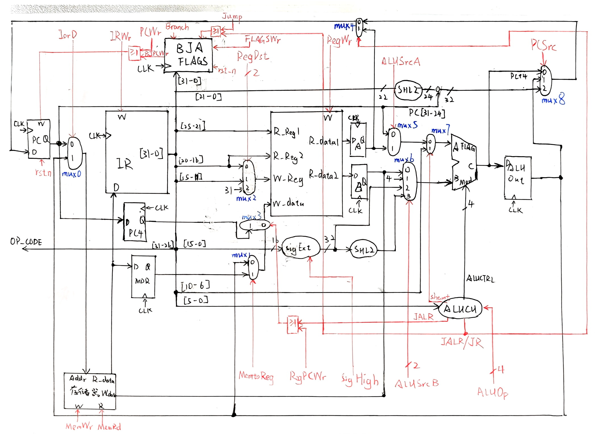
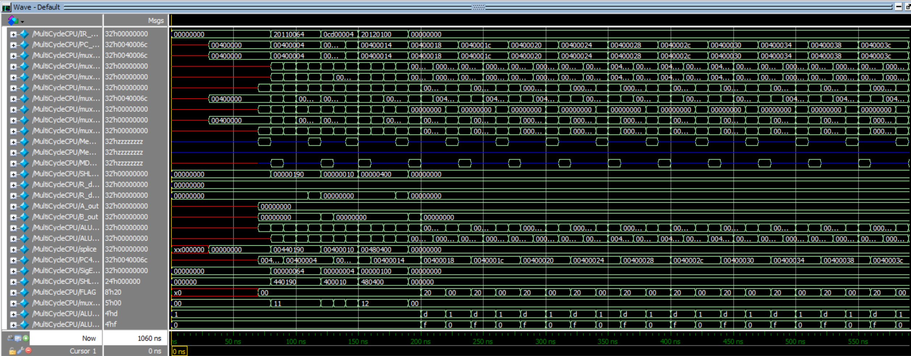

# CPU-Verilog-MultiCycle
XJTU  COMP461805 CPU（Verilog）多周期实现

本仓库为西安交通大学2025秋季学期**计算机试验班**，**计算机组成原理**课程大作业，基于Verilog的指令集CPU实现，包括**单周期、多周期以及流水线**三种结构，对应到本仓库的3个分支：main、multi_cycle、pipeline。本分支为**多周期CPU**的实现。

本仓库的完成人为：
- 计试2301，[李奕博](https://github.com/YiboLi-4110)
- 计试2301，[刘添毅](https://github.com/Leotydk671)

# 多周期CPU简介
多周期 CPU 是指每条指令在**多个时钟周期**内完成**取指、译码、执行、访存、写回**五个阶段。其核心思想是将指令的执行过程分解为多个阶段，每个阶段占用一个时钟周期，从而提高指令的执行效率。

本文中实现的多周期 CPU 支持 MIPS 指令集中的大部分指令，并做了一定的扩展。数据通路的实现在单周期 CPU 的数据通路上进行，在多周期的条件下，主要对控制信号和部件有一定的修改，详见“补充说明”一节

# 指令集：80-MIPS-86
本仓库共实现了<font color='red'>89</font>条指令，与标准的X86-64和MIPS指令集均相似但不相同，具体如下：
| 功能分类 | 助记符与功能 |
|:-----:|:-----:|
| 加载 | LW(加载字) |
| 保存 | SW(存储字) |
| R-R运算 | ADD(加) ADDU(无符号加) SUB(减) SUBU(无符号减) SLL(逻辑左移) SRL(逻辑右移) SRA(算术右移) AND(与) OR(或) XOR(异或) NOR(或非) SLT(有符号小于置1) SLTU(无符号小于置1) |
| R-I运算 | ADDI(加立即数) ADDIU(无符号加立即数) ANDI(与立即数) ORI(或立即数) XORI(异或立即数) LUI(加载立即数至高位) SLTI(小于立即数置1) SLTIU(无符号小于立即数-无符号数) |
| 分支 | BEQ(等于0则分支) BNE(不等于0则分支) BLEZ(小于等于0则分支) BGTZ(大于0则分支) BLTZ(小于0则分支) BGEZ(大于等于0则分支) |
| 跳转 | J(跳转) JAL(跳转并链接) JALR(跳转并链接寄存器) JR(跳转至寄存器) |
| 有条件跳转一 | JE(等于0则跳转) JNE(不等于0则跳转) JA(无符号大于0跳转) JNA(无符号不大于0跳转) JB(无符号小于0则跳转) JNB(无符号不小于0则跳转) JG(有符号大于0则跳转) JNG(有符号小于等于0则跳转) JL(有符号小于0则跳转) JNL(有符号不小于0则跳转) JS(符号位为1则跳转) JNS(符号位为0则跳转) JO(溢出则跳转) JNO(不溢出则跳转) |
| 有条件跳转二（不同种类详见有条件跳转一） | JALE JALNE JALA JALNA JALB JALNB JALG JALNG JALL JALNL JALS JALNS JALO JALNO |
| 有条件跳转三（不同种类详见有条件跳转一） | JALRE JALRNE JALRA JALRNA JALRB JALRNB JALRG JALRNG JALRL JALRNL JALRS JALRNS JALRO JALRNO |
| 有条件跳转四（不同种类详见有条件跳转一） | JRE JRNE JRA JRNA JRB JRNB JRG JRNG JRL JRNL JRS JRNS JRO JRNO |


# 数据通路
本文中实现的多周期 CPU 的数据通路实现了使用尽量少的部件，实现尽量多的指令。其中合并、删去、添加的部件和控制信号详见“补充说明”一节

具体的数据通路如下图所示：


# 补充说明
多周期 CPU 数据通路相对于单周期 CPU 数据通路，主要的变动如下：
- 合并数据、指令存储器为主存储器。
- 添加了三路选择器和四路选择器。
- 将原本的控制信号 ALUSrc 一分为二，分别为 ALUSrcA 和 ALUSrcB，用于选择 ALU
的输入源。
- 添加了自定义模块 BJA 和 FLAGS，与单周期 CPU 的数据通路相同，详见`main`分支。还有部分微小变动这里并未列出

# 测试结果
同样，本文设计了多种测试脚本对多周期 CPU 进行测试，限于篇幅，仅展示其中一个。

下面是测试脚本：
```mips
.text
    .globl main

main:
    addi $s1, $zero, 100
    jala target
    addi $s2, $zero, 64
    jr $ra
target:
    addi $s2, $zero, 256
```

下面是测试脚本对应的多周期 CPU 的波形输出：
