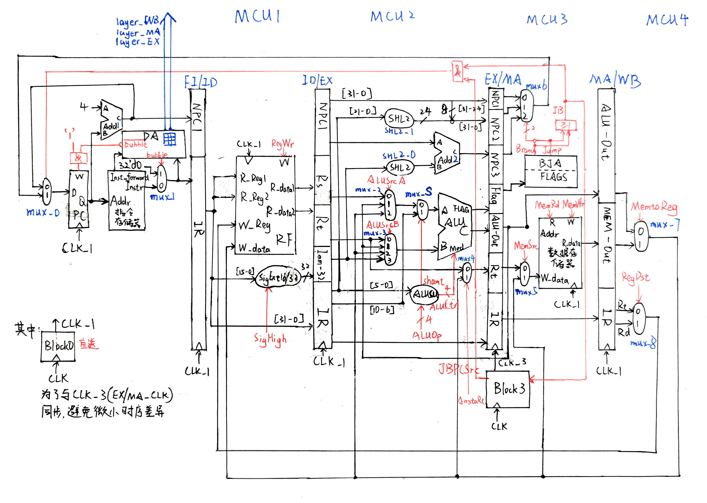

# CPU-Verilog-Pipeline
XJTU  COMP461805 CPU（Verilog）流水线实现

本仓库为西安交通大学2025秋季学期**计算机试验班**，**计算机组成原理**课程大作业，基于Verilog的指令集CPU实现，包括**单周期、多周期以及流水线**三种结构，对应到本仓库的3个分支：main、multi_cycle、pipeline。

本分支为**流水线CPU**的实现。

本仓库的完成人为：
- 计试2301，[李奕博](https://github.com/YiboLi-4110)
- 计试2301，[刘添毅](https://github.com/Leotydk671)

# 流水线CPU简介
CPU的流水线技术是一种通过将指令执行过程分解为多个阶段，从而实现多条指令**并行处理**的技术，显著提高了处理器的性能。

本文实现的流水线CPU是将一条指令的执行过程分解为了5个阶段，也可以称为是“五级流水CPU”，5个阶段分别为：**取指令（FI）、指令译码（ID）、执行指令（EX）、存储器访问（MA）和数据写回（WB）**。

设计流水线CPU的核心思想是添加**中间寄存器**，具体的数据通路详见后文中的**数据通路**部分。

# 指令集：80-MIPS-86
本仓库共实现了<font color='red'>44</font>条指令，与标准的X86-64和MIPS指令集均相似但不相同，具体如下：
| 功能分类 | 助记符与功能 |
|:-----:|:-----:|
| 加载 | LW(加载字) |
| 保存 | SW(存储字) |
| R-R运算 | ADD(加) ADDU(无符号加) SUB(减) SUBU(无符号减) SLL(逻辑左移) SRL(逻辑右移) SRA(算术右移) AND(与) OR(或) XOR(异或) NOR(或非) SLT(有符号小于置1) SLTU(无符号小于置1) |
| R-I运算 | ADDI(加立即数) ADDIU(无符号加立即数) ANDI(与立即数) ORI(或立即数) XORI(异或立即数) LUI(加载立即数至高位) SLTI(小于立即数置1) SLTIU(无符号小于立即数-无符号数) |
| 分支 | BEQ(等于0则分支) BNE(不等于0则分支) BLEZ(小于等于0则分支) BGTZ(大于0则分支) BLTZ(小于0则分支) BGEZ(大于等于0则分支) |
| 跳转 | J(跳转) JAL(跳转并链接) JALR(跳转并链接寄存器) JR(跳转至寄存器) |
| 有条件跳转| JE(等于0则跳转) JNE(不等于0则跳转) JA(无符号大于0跳转) JNA(无符号不大于0跳转) JB(无符号小于0则跳转) JNB(无符号不小于0则跳转) JG(有符号大于0则跳转) JNG(有符号小于等于0则跳转) JL(有符号小于0则跳转) JNL(有符号不小于0则跳转) JS(符号位为1则跳转) JNS(符号位为0则跳转) JO(溢出则跳转) JNO(不溢出则跳转) |


# 数据通路
本文中实现的流水线 CPU 数据通路是在`main`分支中设计的单周期 CPU 数据通路的基础上，添加中间寄存器完成的，同时还添加了**新的自定义部件 DA 和 Block3**，分别解决用来解决**数据冒险和控制冒险**。对于自定义部件的详细介绍见“补充说明”一节。

具体的数据通路如下：


# 补充说明
这里详细说明本文在实现流水线 CPU 时，为了解决数据冒险和控制冒险，分别添加的两个**自定义模块：DA 与 Block3**。
- **DA** 模块：用于解决**数据冒险**。设计思路是，考虑每条指令对于寄存器堆的访问与修改，每条指令最多对寄存器堆的进行两次访问和最多一次修改，因此，DA 中记录了处于 EX、MA、WB 状态的三条指令的访问和修改的**寄存器号**，维护一个 3×3 的数组。记录了访问和修改的寄存器后，通过 3×3 的矩阵即可判断是那种类型的数据冒险，并做出对应的控制。
- **Block3** 模块：用于解决**控制冒险**。设计思路是，当遇到**跳转指令**的时候，如果跳转条件成立，则对 EX 阶段和 MA 阶段的中间寄存器进行**阻塞**，连续阻塞若干周期后，即可令刚刚跳转指令**紧随其后的指令“消耗殆尽”**，从而直接执行跳转目标地址的指令

# <font color='blue'>冒险情况的解决思路</font>
对于流水线 CPU 而言，可以将所有流水线冒险分为 3 类：**数据冒险、控制冒险和结构冒险**。下面详细阐述本实验中解决三种冒险的具体方法。
- **数据冒险**：本文解决数据冒险是通过结合“后退法”和设置带旁路技术的 ALU 来进行解决。其中，是否以及选择哪个旁路，以及何时插入气泡，都由 DA 模块来完成，注意此时一次性解决了**连续两条和连续三条**指令带来的数据冒险，由于本文实现的是五级流水线 CPU，因此不需要考虑**连续四条指令**的数据冒险。
- **控制冒险**：控制冒险是在跳转指令执行时发生的，本文的解决方法是直接的**阻塞**，同时，考虑到如果在跳转指令之后紧跟着的指令是**需要插入气泡解决数据冒险的指令**，而多出的气泡则原解决框架下无法预知，因此，这里**采取了在跳转指后，阻塞四个时钟周期，相当于令跳转地址的指令在正式执行前空转一次，再次基础上对指令进行“提前取指令”，判断是否有气泡，二者结合便解决了控制冒险的所有情况**。
- **结构冒险**：结构相关的问题通过资源重复或者“部件冗余”的方法进行解决，即这一部分的解决方法就展示在了数据通路当中，这里不再赘述。

# 测试结果
同样，本文设计了多种测试脚本对流水线 CPU 进行测试，限于篇幅，仅展示其中一个。

下面是测试脚本：
```mips
.text 
    .globl main
main:
    addi $s1, $zero, 16
    addi $s2, $zero, 32
    add $t0, $s1, $s2
    sub $s0, $t0, $s1
    sub $v1, $t0, $s0
```

下面是测试脚本对应的流水线 CPU 的波形输出：

